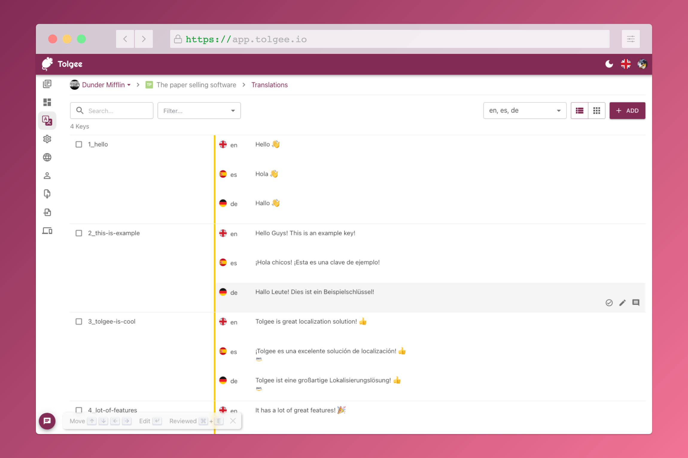

# Tolgee CI/CD pipeline

Deploy Tolgee with CI/CD on Elestio

 
 

# Once deployed ...

You can open Tolgee here:

    URL: https://[CI_CD_DOMAIN]
    Login: [ADMIN_EMAIL]
    Password: [ADMIN_PASSWORD]

You can open pgAdmin here:

    URL: https://[CI_CD_DOMAIN]:18338
    Login: [ADMIN_EMAIL]
    Password: [ADMIN_PASSWORD]
